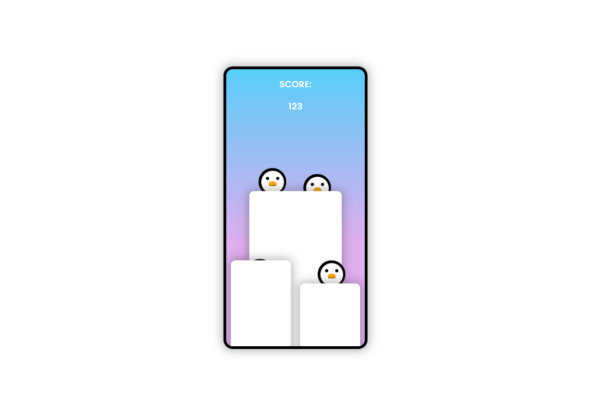

<h1>README - PenguinGame</h1>

 

Este es un pequeño proyecto de juego desarrollado con HTML, CSS y JavaScript. A continuación, se proporciona una breve descripción del juego:
Descripción del Juego

Abre el archivo contador.html en tu navegador.
Haga Click sobre los pinguinos para aumentar el marcador

<b>Tecnologías Utilizadas</b>

<ul>
 <li>HTML: Estructura básica del juego.</li>
 <li>CSS: Estilos para una experiencia visual agradable.</li>
 <li>JavaScript: Lógica y manejo de eventos.</li>
</ul>

<b>Contribuciones</b>

Siéntete libre de realizar mejoras, correcciones de errores o agregar nuevas funciones. ¡Las contribuciones son bienvenidas!
Agradecimiento.
